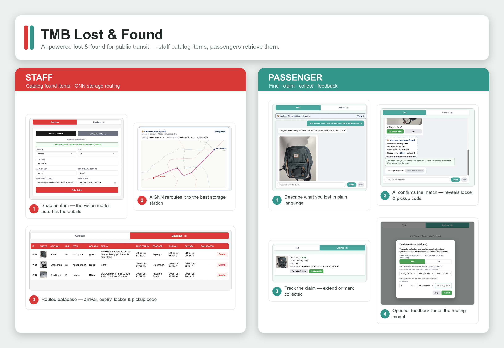

# Lost & Found — TMB (Barcelona Metro) Solution

An AI-powered lost-and-found system for Barcelona's public transport network
(**TMB** — *Transports Metropolitans de Barcelona*).

The project combines two ideas:

1. A **staff/passenger web app** where found items are photographed, automatically
   described by a local vision model, and searched by passengers through an LLM chatbot.
2. A **Graph Neural Network (GNN)** that predicts *where on the metro network a lost item
   is most likely to be reclaimed*, and a decision rule that routes each item to the
   storage station that minimises the expected travel distance for its owner.

Everything runs **locally and offline** — no cloud APIs, no keys.



---

## Repository layout

| Folder / file | What it is |
|---|---|
| **`TMB/`** | The demo application — Python HTTP server + SQLite + local LLMs (Ollama). Staff add items, passengers search via chat. |
| **`GNN/`** | The heterogeneous Graph Convolutional Network that predicts pickup stations and the storage-routing decision rule, plus training/ablation/baseline scripts and written analysis. |
| **`BCNGNN/`** | An earlier, self-contained GNN prototype on the Barcelona metro graph (kept for reference). |
| **`Final report.pdf` / `.docx`** | Full written project report. |
| **`lost_found_barcelona_report.pdf`** | Shorter standalone report on the lost-and-found problem. |

---

## 1. `TMB/` — the application

A single-page web app served by a dependency-free Python server (standard library only).
It uses two LLMs:

- **`llava`** via [Ollama](https://ollama.com) (vision) — auto-describes a photographed
  found item (type, colours, features).
- **Claude** for the passenger search chatbot — `app.py` shells out to the local
  `claude` CLI (Claude Code, model `claude-sonnet-4-6`). It uses your existing local
  Claude Code login; no API key is stored in the repo. Override the binary with the
  `CLAUDE_CLI` environment variable.

Two modes share one server and database:

- **Employee** — *Add Item* + *Database* tabs. Each saved item is auto-routed by the GNN
  to a storage station, with arrival ETA, expiry, locker and pickup code.
- **User** — *Find* (LLM chat) + *Claimed items* tabs. The chatbot only confirms a match
  when the passenger supplies enough detail, then reveals the locker and code.

### Run it

```bash
# 1. Install Ollama from https://ollama.com, then pull the vision model (one-time):
ollama pull llava
ollama serve

# (The Find chat uses your local `claude` CLI — install Claude Code separately.)

# 2. In another terminal:
cd TMB
python3 app.py                 # employee mode (default)
python3 app.py --mode user     # passenger-facing mode
```

Open **http://localhost:8080**. See [`TMB/README.md`](TMB/README.md) for full usage,
test images, and notes. GNN routing uses a trained model in `GNN/artifacts/models/`;
if it is missing, items are still saved but no storage station is assigned.

---

## 2. `GNN/` — predicting where lost items get reclaimed

A heterogeneous GCN (R-GCN-style message passing + DistMult-style scoring head) that
predicts the station where a passenger will pick up a lost item, conditioned on the item
type and time context. A decision rule then picks the storage station that minimises the
expected metro travel distance from the predicted pickup location.

Trained on synthetic passenger-profile events; designed to extend to real questionnaire
data. The folder includes:

- **Model & data** — `model.py`, `graph_build.py`, `events.py`, `contexts.py`,
  `decision.py`, `network.py`, `metro.py`, `synth.py`, `train.py`.
- **Evaluation / ablations** — `ablate.py`, `ablate_shared_relations.py` (R-GCN vs GCN),
  `coldstart.py` (inductive, hold-out stations), `ml_baselines*.py` (MLP/LogReg/RF/kNN),
  `sweep_lambda.py` (movement-cost tradeoff).
- **Reports** (`docs/`) — `OVERVIEW.md` (plain-language model explanation),
  `TMB_return_rate_analysis.md` / `TMB_summary.md` (return-rate analysis and locker-network
  business case), with rendered PDFs.
- **`artifacts/`** — generated corpora, model checkpoints, figures, logs and baseline metrics.

Start with [`GNN/README.md`](GNN/README.md) and [`GNN/docs/OVERVIEW.md`](GNN/docs/OVERVIEW.md).

---

## 3. `BCNGNN/` — earlier prototype

A smaller, self-contained version of the metro-graph GNN (`metro.py`, `network.py`,
`model.py`, `train.py`, `synthetic.py`, `aggregate.py`, `visualize.py`) with its own
`artifacts/`. Kept for reference and comparison with the later `GNN/` work.

---

## Requirements

- **Python 3.10+** — the `TMB/` app uses only the standard library.
- **Ollama** with the `llava` model (for the app's image description).
- **Claude Code** (`claude` CLI) on your PATH and logged in (for the Find chatbot).
- The `GNN/` training/eval scripts use PyTorch (see imports in the scripts).
- ~8 GB free RAM to run the local vision model.

## Notes

- The SQLite database (`TMB/entries.db`) is generated at runtime and is **not** tracked.
- `__pycache__/`, `.DS_Store`, and local tooling files are excluded via `.gitignore`.
